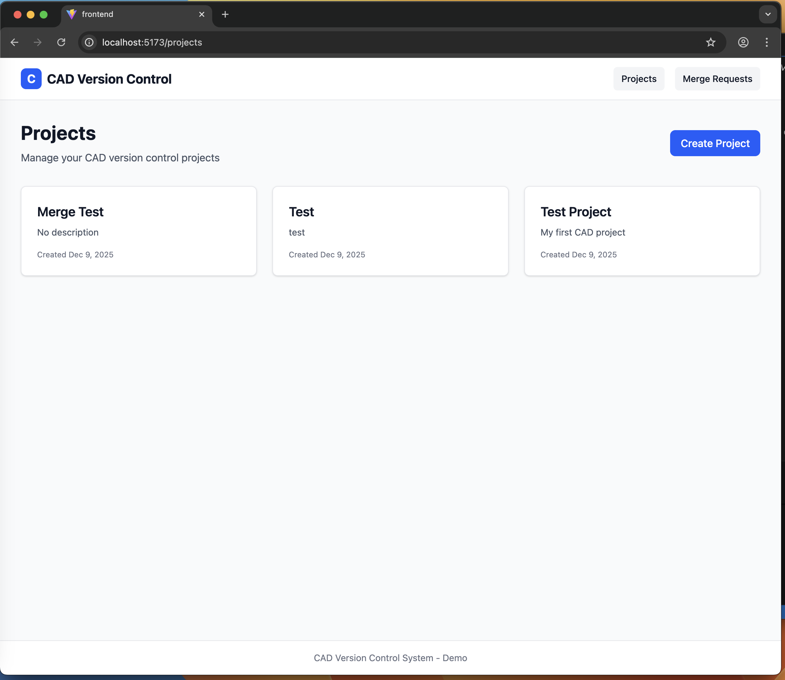
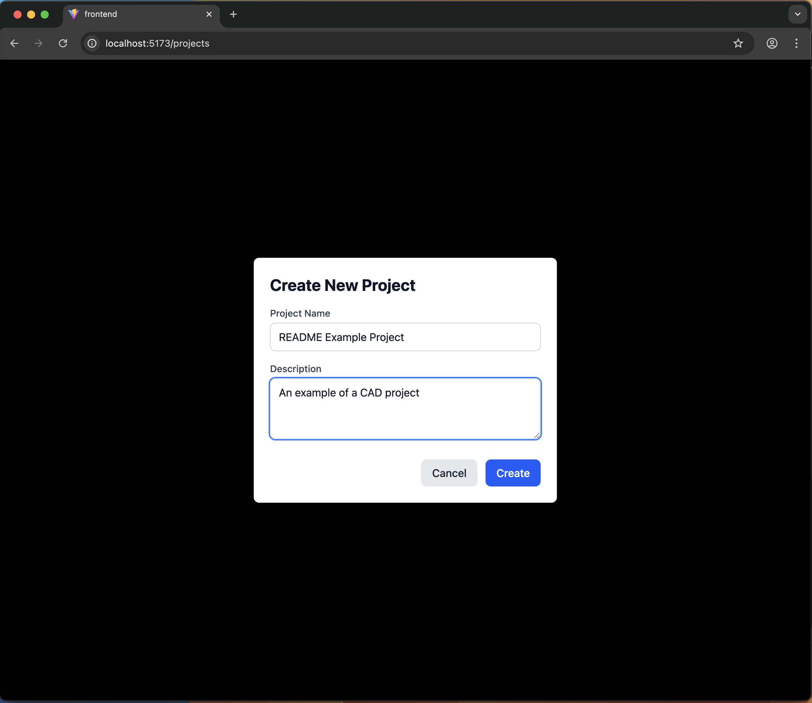
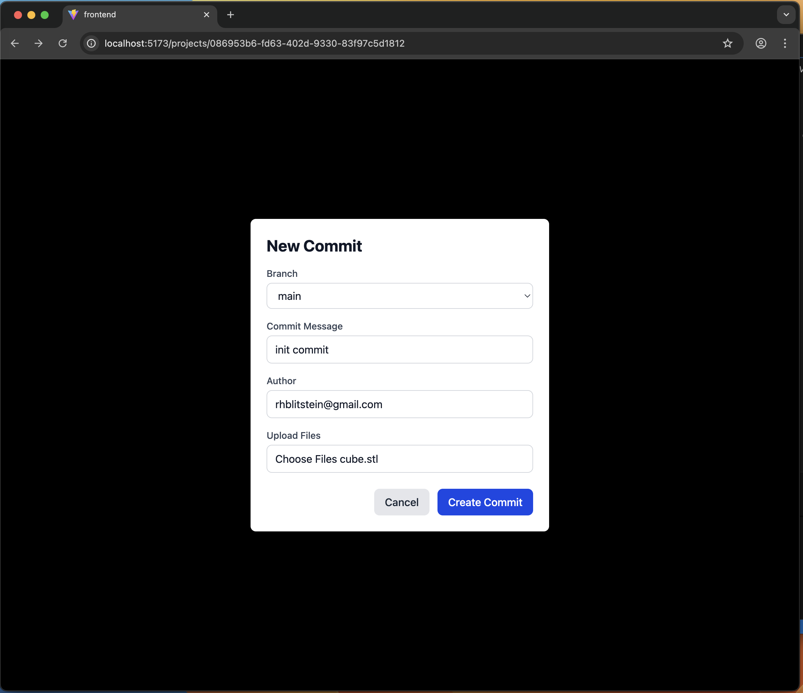
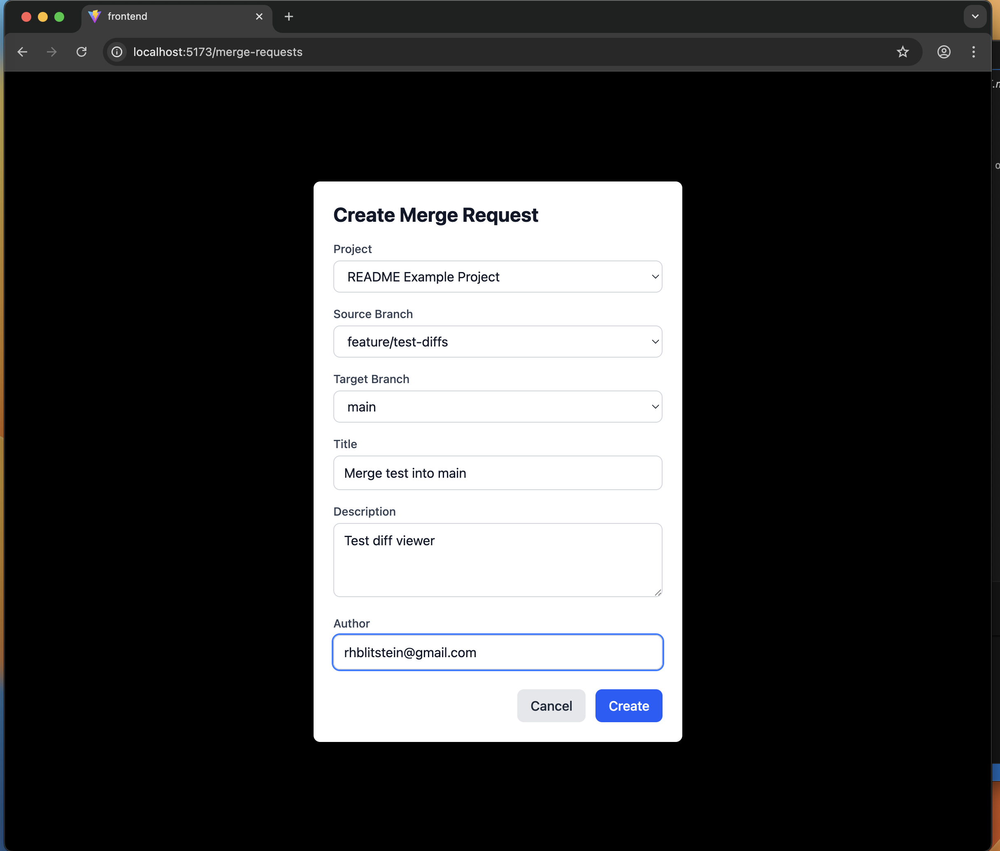
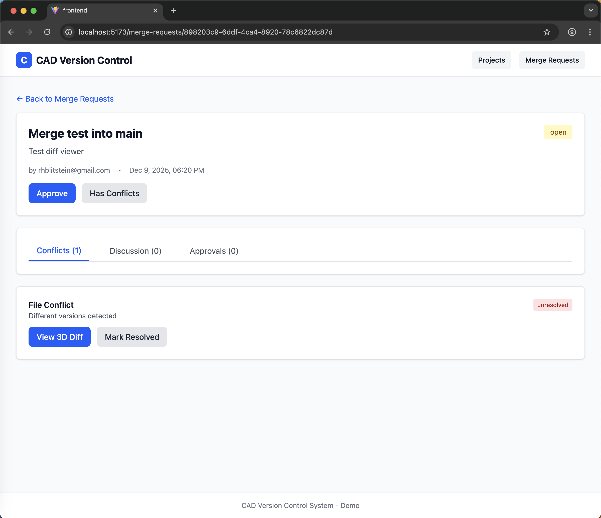
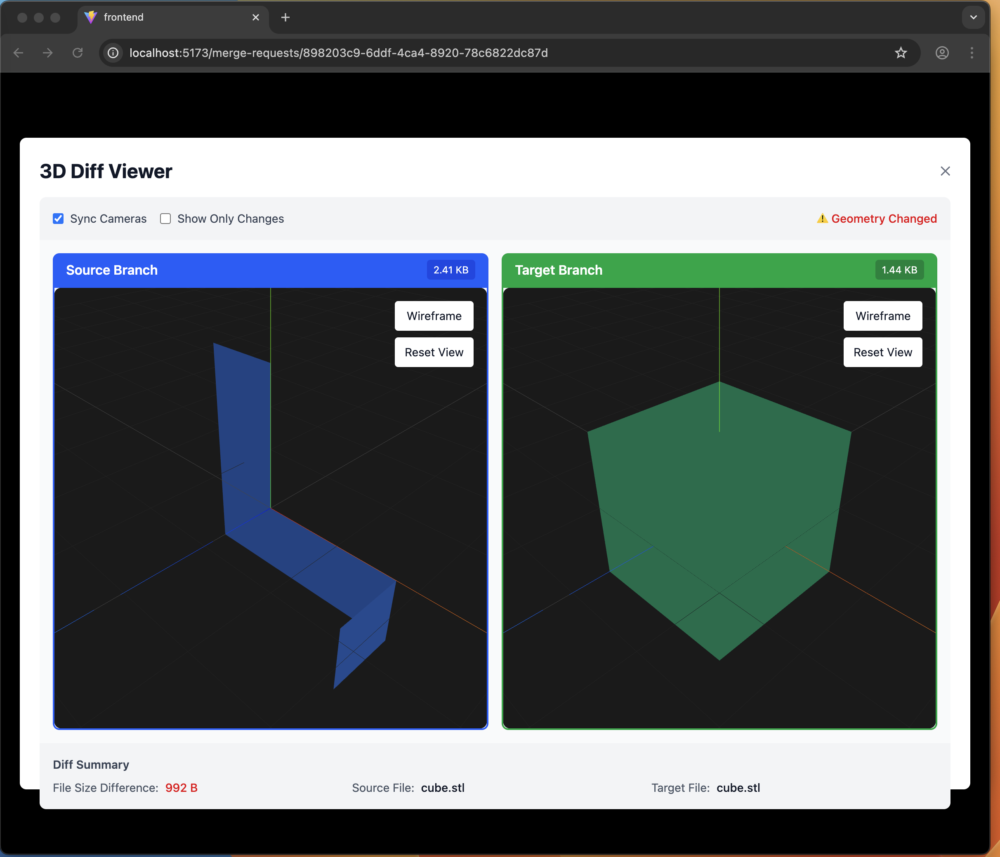

# CAD Version Control System

> A Git-like version control system for CAD files, built with Go, Vue.js, PostgreSQL, and MinIO, inspired by [AllSpice.io](https://allspice.io).


## 🎯 Overview

This system brings Git-like version control to CAD workflows, enabling teams to:
- **Branch** designs for parallel development
- **Commit** versions with full history tracking
- **Merge** changes with visual 3D diff viewers
- **Review** geometry changes before merging
- **Collaborate** with comments and approvals

## 📸 Screenshots

### Project Dashboard
Manage all your CAD projects in one place with an intuitive card-based interface.



### Create New Project
Start a new CAD project with a name and description.



### Commit Changes
Upload STL files with commit messages, just like Git.



### Create Merge Request
Request to merge changes from one branch to another, with automatic conflict detection.



### Review Conflicts
See detected conflicts with options to view 3D diffs or mark as resolved.



### 3D Diff Viewer
Side-by-side 3D comparison of CAD files with synchronized camera controls.



## 🏗️ Architecture

```
┌─────────────────┐
│   Vue Frontend  │  ← Modern UI with 3D viewers
└────────┬────────┘
         │ REST API
┌────────▼────────┐
│   Go API Server │  ← Version control logic
└────────┬────────┘
         │
    ┌────┴─────┬──────────┬──────────┐
    ▼          ▼          ▼          ▼
┌────────┐ ┌────────┐ ┌────────┐ ┌──────────┐
│Postgres│ │ MinIO  │ │ Redis  │ │ RabbitMQ │
└────────┘ └────────┘ └────────┘ └──────────┘
 Metadata   Files     Cache      Async Jobs
```

### Tech Stack

**Backend:**
- **Go 1.21+** - High-performance API server
- **Chi Router** - Lightweight HTTP router
- **PostgreSQL 15** - ACID-compliant version history
- **MinIO** - S3-compatible object storage
- **Redis** - Caching layer for performance
- **RabbitMQ** - Message queue for async operations

**Frontend:**
- **Vue 3** - Reactive UI framework with Composition API
- **Tailwind CSS** - Utility-first styling
- **Three.js** - 3D rendering for STL files
- **Pinia** - State management
- **Vue Router** - Client-side routing
- **Axios** - HTTP client

**Infrastructure:**
- **Docker & Docker Compose** - Containerization
- **Kubernetes-ready** - Scalable deployment

## 🚀 Quick Start

### Prerequisites

- Docker Desktop or Colima
- Node.js 18+ (via NVM recommended)
- Go 1.21+ (optional, for local development)

### Installation

1. **Clone the repository**
```bash
git clone https://github.com/rhblitstein/cad-version-control.git
cd cad-version-control
```

2. **Start the backend services**
```bash
# Start Postgres, MinIO, Redis, RabbitMQ, and API
docker-compose up -d

# Wait ~30 seconds for services to initialize
docker-compose ps  # All should show "healthy"
```

3. **Start the frontend**
```bash
cd frontend
npm install
npm run dev
```

4. **Open your browser**
```
http://localhost:5173
```

### Service URLs

| Service | URL | Credentials |
|---------|-----|-------------|
| Frontend | http://localhost:5173 | - |
| API | http://localhost:8080 | - |
| MinIO Console | http://localhost:9001 | minioadmin / minioadmin |
| RabbitMQ Management | http://localhost:15672 | caduser / cadpass |
| PostgreSQL | localhost:5432 | caduser / cadpass / cadversion |

## 📖 Usage

### 1. Create a Project
- Click "Create Project"
- Enter name and description
- Project appears in the grid

### 2. Create Branches
- Click into a project
- Click "Create Branch"
- Optionally fork from existing branch

### 3. Upload Files
- Click "New Commit"
- Select branch
- Add commit message
- Upload STL files
- Files are deduplicated by SHA-256 checksum

### 4. Create Merge Requests
- Navigate to "Merge Requests"
- Create MR between branches
- System detects conflicts automatically

### 5. Review Changes
- View 3D diffs side-by-side
- Synchronized camera controls
- Add comments and approvals
- Resolve conflicts
- Merge when ready

## 🎨 Features

### ✅ Version Control
- [x] Git-like branching model (DAG)
- [x] Commit history with parent linkage
- [x] File deduplication via content hashing
- [x] Branch protection (via merge requests)

### ✅ 3D Visualization
- [x] STL file rendering with Three.js
- [x] Wireframe/solid toggle
- [x] Orbit controls with damping
- [x] Side-by-side diff viewer
- [x] Synchronized cameras

### ✅ Collaboration
- [x] Merge request workflow
- [x] Comment threads
- [x] Approval system
- [x] Conflict detection
- [x] Manual conflict resolution

### ✅ Performance
- [x] Redis caching for branch HEADs
- [x] Content-addressable storage
- [x] Lazy loading for file lists
- [x] Optimistic UI updates

## 🏛️ Database Schema

Key tables:
- `projects` - Top-level containers
- `branches` - Git-like branches with HEAD pointers
- `commits` - Version snapshots forming a DAG
- `files` - Logical file identities
- `file_versions` - Content snapshots at commits
- `merge_requests` - Branch merge workflow
- `merge_conflicts` - Conflict tracking
- `comments` & `approvals` - Collaboration

[Full schema](backend/migrations/001_init_schema.sql)

## 🔧 Development

### Backend (Go)

```bash
cd backend

# Run locally (without Docker)
export DB_HOST=localhost
export MINIO_ENDPOINT=localhost:9000
# ... set other env vars
go run cmd/api/main.go

# Run tests
go test ./...

# Build
go build -o api cmd/api/main.go
```

### Frontend (Vue)

```bash
cd frontend

# Install dependencies
npm install

# Start dev server
npm run dev

# Build for production
npm run build

# Preview production build
npm run preview
```

### Docker

```bash
# Rebuild services
docker-compose up -d --build

# View logs
docker-compose logs -f api

# Stop everything
docker-compose down

# Remove volumes (clean slate)
docker-compose down -v
```

## 📊 API Endpoints

### Projects
- `POST /api/projects` - Create project
- `GET /api/projects` - List all projects
- `GET /api/projects/{id}` - Get project details

### Branches
- `POST /api/projects/{project_id}/branches` - Create branch
- `GET /api/projects/{project_id}/branches` - List branches
- `GET /api/branches/{id}` - Get branch details

### Commits
- `POST /api/projects/{project_id}/commits` - Create commit (multipart)
- `GET /api/commits/{id}` - Get commit details
- `GET /api/branches/{branch_id}/commits` - List commits

### Files
- `GET /api/file-versions/{id}/download` - Download file
- `GET /api/files/{id}/versions` - List file versions

### Merge Requests
- `POST /api/merge-requests` - Create MR
- `GET /api/merge-requests` - List MRs (filterable)
- `GET /api/merge-requests/{id}` - Get MR details
- `POST /api/merge-requests/{id}/approve` - Approve MR
- `POST /api/merge-requests/{id}/merge` - Execute merge

### Conflicts
- `GET /api/merge-requests/{id}/conflicts` - List conflicts
- `GET /api/conflicts/{id}/diff` - Get geometric diff
- `POST /api/conflicts/{id}/resolve` - Mark resolved

## 🎓 Design Decisions

### Why STL instead of native CAD?
**Demo:** STL files are triangle meshes - simple to parse and render in browsers with Three.js.

**Production:** Would need geometry kernels (Parasolid, OpenCascade) to parse native CAD formats (STEP, SOLIDWORKS) and preserve parametric design intent.

### Why checksum-based diffing?
**Demo:** SHA-256 comparison is fast and reliable for detecting changes.

**Production:** Would add geometric analysis to quantify changes (vertices moved, faces added/removed) and enable intelligent auto-merging.

### Why manual conflict resolution?
**Demo:** Keeps logic simple - user chooses which version to keep.

**Production:** Could implement 3-way geometric merging for non-overlapping changes, similar to Git's text merging but for 3D geometry.

### Why single Postgres instance?
**Demo:** Simple deployment, ACID guarantees for correctness.

**Production:** Would add read replicas for scaling, partitioning for large tables, and connection pooling (PgBouncer).

## 🚧 Known Limitations

**Current (Demo):**
- No authentication/authorization
- No rate limiting
- Single API server (no horizontal scaling)
- STL only (no native CAD formats)
- Manual conflict resolution only
- No file locking
- No branch permissions

**Future Enhancements:**
- WebSocket real-time updates
- Native CAD format support (STEP, IGES)
- Intelligent geometric merging
- ML-powered conflict suggestions
- CAD tool plugins (SOLIDWORKS, Inventor)
- Multi-tenant architecture
- Advanced analytics

## 🧪 Testing

```bash
# Backend
cd backend
go test ./...

# Frontend
cd frontend
npm run test

# Integration tests
# (requires running services)
./scripts/integration_test.sh
```

## 👤 Author

**Rebecca Blitstein**
- GitHub: [@rhblitstein](https://github.com/rhblitstein)
- LinkedIn: [Rebecca Blitstein](https://www.linkedin.com/in/rebecca-blitstein-0509a023a/)

## 🙏 Acknowledgments

- Built as a technical demonstration for AllSpice.io
- Thanks to the Go, Vue, and Three.js communities

---

**⚡ This project demonstrates:**
- Distributed version control (Git internals)
- 3D geometry handling and visualization
- Real-time collaboration patterns
- Scalable architecture design
- Modern full-stack development (Go + Vue + PostgreSQL)